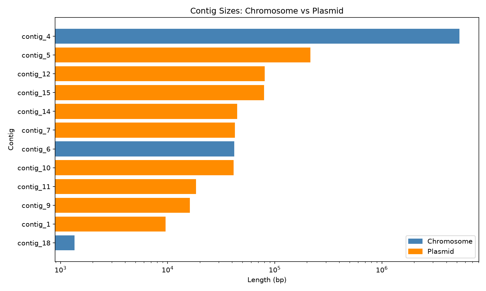
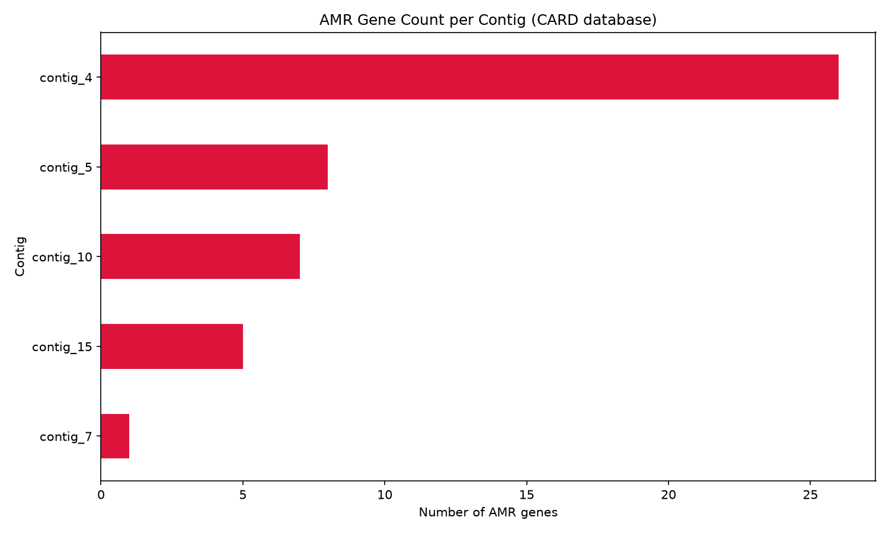
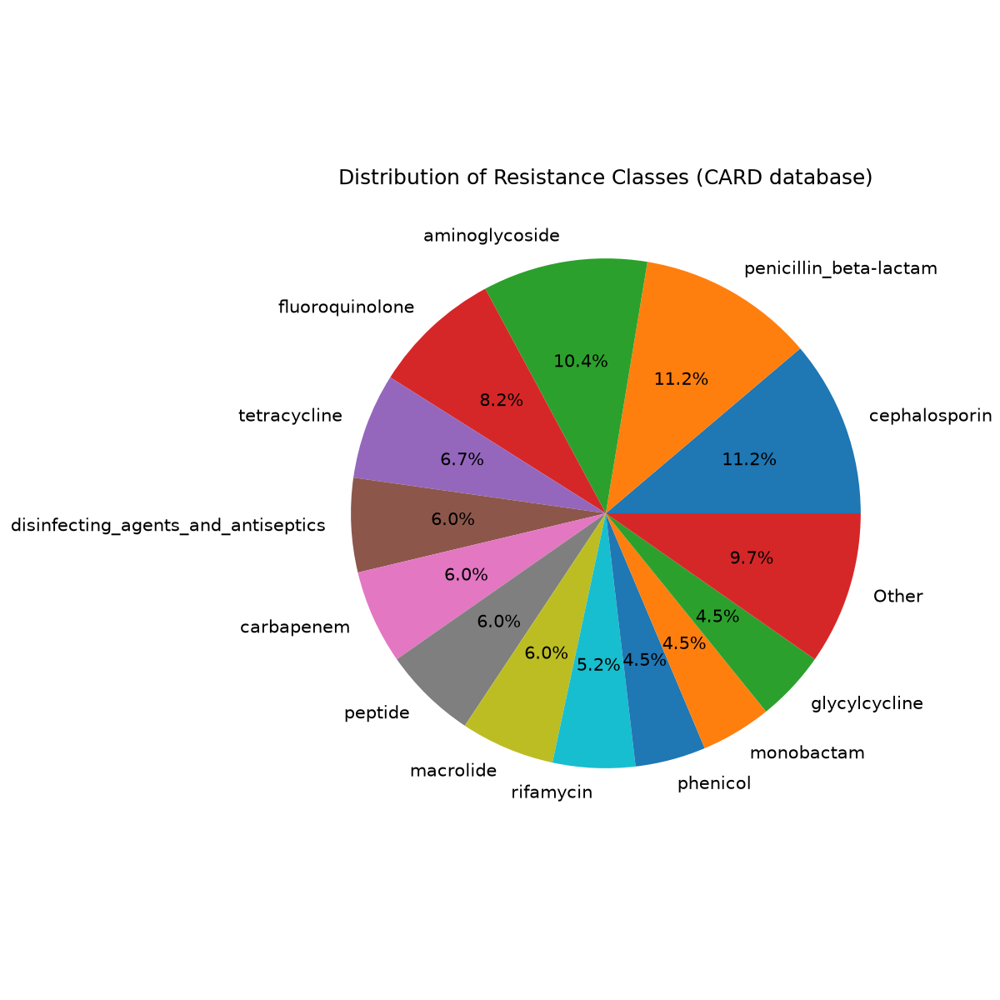

## 1. Executive Summary

This report describes the analysis of raw Nanopore sequencing reads from a bacterial isolate. The sample came from a patient whose infection did not respond to standard antibiotics.
The organism was identified as *Klebsiella pneumoniae*, strain type ST258. This identification is supported by several independent pieces of evidence: read-based species classification, genome size, GC content, and a formal strain-typing method (MLST).
The most important finding is a gene called KPC-3. This gene gives the bacteria resistance to carbapenem antibiotics. Carbapenems are often used as a last-resort treatment when other antibiotics do not work. This gene was found on a plasmid, not on the main chromosome. A plasmid is a small piece of DNA that can move from one bacterium to another. This means the resistance could spread to other bacteria.
The isolate also carries several other resistance genes, affecting antibiotic classes such as aminoglycosides, sulfonamides, and cephalosporins. It shows a typical virulence profile for this species, without signs of an unusually aggressive "hypervirulent" strain.
Overall, we have high confidence in the species identification and in the main resistance finding, because multiple independent methods point to the same result.

## 2. Note to Prof. Kılıç

Dear Prof. Kılıç,
We looked at the DNA of the bacteria from your patient's sample. Here is what we found, in simple terms.

**What is the bacteria?**
The bacteria is called *Klebsiella pneumoniae*. This is a common bacteria that can cause infections in hospitals, especially in the lungs, blood, or urinary tract.

**What is it resistant to?**
This bacteria carries a gene that makes it resistant to a group of antibiotics called carbapenems. Carbapenems are usually one of the strongest options doctors use when other antibiotics fail. This bacteria is also resistant to several other common antibiotics.

**What does this mean for the patient?**
Because the bacteria is resistant to carbapenems, standard treatment may not work. The infection may be harder to treat, and doctors may need to use different or combined antibiotics.

There is another important point. The resistance gene sits on a small, separate piece of DNA called a plasmid. This type of DNA can move between different bacteria. This means there is a risk that this resistance could spread to other bacteria in the hospital, not just stay in this one patient.

**What do we recommend?**
- Confirm this result with a standard lab test, such as a culture and antibiotic susceptibility test (also called an antibiogram). This will directly show which antibiotics still work against this specific bacteria.
- Avoid carbapenem antibiotics as a first choice, since our results suggest they will not work well. An infectious disease specialist should help choose an alternative treatment, possibly a combination of antibiotics.
- Test for colistin and tigecycline susceptibility. These are sometimes used as backup options for carbapenem-resistant bacteria, but resistance to these can also occur, so it should be checked directly.
- Apply contact precautions for this patient, such as isolation and dedicated equipment, to lower the risk of spreading the bacteria to other patients or hospital surfaces.
- Inform the hospital's infection control team. Because the resistance gene sits on a mobile plasmid, this case may be relevant for broader hospital surveillance, not just for this one patient.
- Screen close contacts or patients in the same ward if hospital policy requires it for carbapenem-resistant organisms.

## 3. Key Findings at a Glance

| Question | Finding |
|---|---|
| Organism | *Klebsiella pneumoniae* |
| Strain type | ST258 |
| Most concerning resistance | KPC-3 (carbapenem resistance) |
| Location of KPC-3 | Plasmid (mobile, transferable) |
| Other resistance genes | Yes — genes affecting aminoglycosides, sulfonamides, cephalosporins, and more |
| Virulence profile | Standard for the species; no hypervirulent markers found |
| Overall confidence | High — confirmed by multiple independent methods |

## 4. Methodology

This section explains how we reached our conclusions. It is written for a bioinformatics colleague who wants to check or repeat our work. We used only the raw Nanopore reads as input. No other information about the organism was given in advance. We chose a standard approach used in clinical microbiology: first assemble the genome, then confirm the species, then screen for resistance and virulence genes, then classify each piece of DNA as chromosome or plasmid. We used Docker containers for every tool in this analysis. This was a deliberate choice. Most bioinformatics tools do not run natively on Windows. Docker lets us run these Linux-based tools without installing them directly on the system, and it also keeps a clear record of the exact tool version used for each step. This supports reproducibility, since the same commands should give the same results on any machine with Docker installed. The full list of commands is available in the `code/shell_scripts/` folder. Tool and database versions are listed in `results/tool_versions.md`.

### 4.1 Data Overview

We received one file: `unknown_isolate.fastq.gz`. This file contains raw long-read sequencing data from an Oxford Nanopore (ONT) sequencer.
Before starting the analysis, we checked the quality of the data using NanoPlot (version 1.46.2). The results were:

- Number of reads: 260,294
- Total sequence yield: 576,590,333 bp (about 576.6 Mbp)
- Mean read length: 2,215 bp
- Median read length: 523 bp
- Read length N50: 15,932 bp
- Longest single read: 210,485 bp
- Mean read quality: Q20.1 (about 99% base accuracy)
- Median read quality: Q23.7

We also looked at how much of the data passes different quality levels:

| Quality threshold | Reads passing | Total bases passing |
|---|---|---|
| Q10 | 259,694 (99.8%) | 576.4 Mbp |
| Q15 | 241,637 (92.8%) | 541.7 Mbp |
| Q20 | 193,453 (74.3%) | 445.1 Mbp |
| Q25 | 105,155 (40.4%) | 198.6 Mbp |
| Q30 | 42,168 (16.2%) | 20.5 Mbp |

Almost all reads (99.8%) pass the basic Q10 quality threshold, and about three quarters of the data is above Q20. This means most of the dataset has good, usable quality.

### 4.2 Species and Strain Identification

We used a step-by-step approach to identify the organism. We started with a fast method on the raw reads, then confirmed the result with slower but more precise methods after assembly.

**Step 1: Fast classification with Kraken2**

We first ran Kraken2 (using the Standard-8 database, released 2026-06-26) directly on the raw reads. This gave a quick first signal before spending time on genome assembly. Kraken2 also works as an early check for contamination.

Results:
- 93.18% of reads were classified, 6.82% were unclassified
- 88.75% of classified reads belonged to Bacteria
- 74.26% of reads matched the genus *Klebsiella*
- Within this genus, *Klebsiella pneumoniae* was the clear leading species (16.82% direct match, far above other Klebsiella species such as *K. quasipneumoniae* at 0.47% or *K. variicola* at 0.35%)
- A small amount of *Escherichia coli* signal was seen (0.46%), and a very small amount of human DNA (0.01%)

The small *E. coli* signal and the human DNA signal are both expected. The *E. coli* signal is likely due to genetic similarity between related Enterobacteriaceae species, not a mixed sample. The human DNA is a normal trace contaminant, since the sample was originally taken from a human patient.

**Step 2: Genome assembly with Flye**

We assembled the raw reads into a draft genome using Flye (version 2.9.6). We chose Flye because it is designed specifically for long-read data like ONT, and is a widely used tool for bacterial genome assembly.

Result: a total assembly length of 5,896,333 bp across 12 contigs, with a mean coverage of 96x and an alignment error rate of 1.3% after polishing.

The total genome size (about 5.9 Mbp) matches the known typical genome size of *Klebsiella pneumoniae* (usually around 5.3-5.9 Mbp). This is a second, independent piece of evidence supporting the Kraken2 result.

**Step 3: Assembly quality check with QUAST**

We checked the assembly quality with QUAST (version 5.3.0). Key results:
- Largest contig: 5,306,074 bp
- N50: 5,306,074 bp, N90: 214,836 bp
- GC content: 56.79%
- 0 ambiguous bases (N's) per 100 kbp, indicating a clean, gap-free assembly

The GC content (56.79%) is very close to the published GC content of *Klebsiella pneumoniae* (around 57%). This is a third independent piece of evidence for species identity.

**Step 4: Confirmation with MLST**

Finally, we confirmed the species and determined the strain type using MLST (version 2.32.2), based on the PubMLST *Klebsiella* scheme, which uses 7 housekeeping genes.

Result: the assembly matched the *Klebsiella* scheme with Sequence Type ST258 (allele profile: gapA-3, infB-3, mdh-1, pgi-1, phoE-1, rpoB-1, tonB-79).

ST258 is a well-known, high-risk clonal lineage. It is strongly associated with carbapenem resistance (KPC genes) in published literature and hospital outbreak reports worldwide.

The MLST tool also reported a warning: the same result scored equally well against an *E. coli* MLST scheme. We consider this a housekeeping gene similarity artifact rather than evidence of a mixed or wrong species call, since three independent lines of evidence (Kraken2 genus/species signal, genome size, GC content) all point to *Klebsiella pneumoniae*, and the MLST species-level match itself was unambiguous.

**Conclusion:** Combining all four methods, we identify the organism as *Klebsiella pneumoniae*, strain type ST258, with high confidence.

### 4.3 Antimicrobial Resistance Gene Detection

We screened the assembled genome for resistance genes using abricate (version 1.4.0). We used three independent databases, since different AMR databases can have different gene content and naming conventions. Using more than one database lets us cross-check the results and increases confidence in the findings.

Databases used (all dated 2026-May-1):
- CARD: 6,052 sequences, 47 genes found
- ResFinder: 3,206 sequences, 22 genes found
- NCBI AMRFinderPlus dataset: 8,232 sequences, 24 genes found

The differences in gene counts are expected. CARD has the broadest scope and includes some genes with lower clinical relevance, while ResFinder and NCBI focus more narrowly on genes with confirmed clinical significance.

**Most significant finding: KPC-3**

The gene KPC-3 was found on contig_15, with 100% coverage and 100% identity to the reference sequence in CARD. KPC-3 is a carbapenemase enzyme. It gives resistance to:
- Carbapenems
- Cephalosporins
- Monobactams
- Penicillins (beta-lactams)

Carbapenems are often used as a last-resort antibiotic class in clinical practice, when other treatments fail. Finding a gene that gives resistance to this class is the most clinically important result in this analysis.

**Other resistance genes found**

On the same contig as KPC-3 (contig_15), we also found:
- TEM-150 (99.88% identity) — cephalosporin, monobactam, penicillin resistance
- OXA-9 (100% identity) — penicillin/beta-lactam resistance
- aadA and AAC(6')-Ib10 — aminoglycoside resistance

On contig_10, we found a cluster of resistance genes: APH(4)-Ia, AAC(3)-IVa, sul3, qacL, aadA, cmlA1, aadA2. These give resistance to aminoglycosides, sulfonamides, and phenicols (such as chloramphenicol). The CARD database descriptions for these genes frequently mention "plasmid-encoded", which is an early hint that this contig may also be a plasmid.

On contig_5, we found another resistance gene cluster: APH(3')-Ia, mphA, Mrx, sul1, qacEdelta1, aadA2, dfrA12, catA1. These affect aminoglycosides, macrolides, sulfonamides, trimethoprim, and phenicols. Many of these genes are described as "integron-encoded", another common feature of mobile, plasmid-based resistance elements.

On contig_7, we found SHV-12, an extended-spectrum beta-lactamase (ESBL) gene, giving resistance to cephalosporins and penicillins.

**Intrinsic, chromosome-based resistance mechanisms**

On contig_4 (the main chromosome), we found genes for efflux pumps and outer membrane proteins, including acrA, acrB, ompA, OmpK37, and the *Klebsiella*-specific KpnE/F/G/H system. These are considered intrinsic resistance mechanisms — natural, built-in features of this species, rather than genes acquired from another organism. They contribute to reduced antibiotic penetration and general drug tolerance, but are a normal part of the species' baseline biology.

**Summary**

The isolate carries a broad resistance profile, affecting at least eight antibiotic classes (carbapenem, cephalosporin, monobactam, penicillin, aminoglycoside, sulfonamide, phenicol, macrolide). The most clinically concerning gene is KPC-3, due to its effect on carbapenems.

### 4.4 Plasmid vs Chromosome Localization

To answer whether resistance genes sit on the chromosome or on a mobile plasmid, we used MOB-suite (mob_recon, version 3.1.9). This tool does not rely on contig size alone. It looks for real biological evidence, such as plasmid replication genes and mobilization genes, to classify each contig as chromosomal or plasmid-borne.

**Result overview**

MOB-suite classified the 12 contigs as follows:

| Contig | Size (bp) | Classification | Plasmid cluster | Inc type |
|---|---|---|---|---|
| contig_4 | 5,306,074 | Chromosome | — | — |
| contig_6 | 41,786 | Chromosome | — | — |
| contig_18 | 1,349 | Chromosome | — | — |
| contig_1 | 9,539 | Plasmid | AA274 | — |
| contig_9 | 16,075 | Plasmid | AA274 | rep_cluster_1418 |
| contig_10 | 41,153 | Plasmid | AA274 | IncR |
| contig_7 | 42,424 | Plasmid | AA274 | IncFII, IncR |
| contig_12 | 80,507 | Plasmid | AA274 | IncFII |
| contig_5 | 214,836 | Plasmid | AA274 | IncFIB, IncFII |
| contig_15 | 79,489 | Plasmid | AA372 | IncI2 |
| contig_11 | 18,370 | Plasmid | AD548 | — |
| contig_14 | 44,731 | Plasmid | AB536 | — |

Three contigs were classified as chromosomal, including the large main chromosome (contig_4, 5.3 Mbp). The remaining 9 contigs were grouped into 4 separate plasmid clusters.

**Key finding: the KPC-3 gene sits on a plasmid**

Contig_15, which carries the KPC-3 carbapenemase gene (see section 4.3), was classified as a plasmid. It belongs to cluster AA372 and has an IncI2 replicon type. MOB-suite also detected a MOBP relaxase gene on this contig. A relaxase gene is part of the molecular machinery a plasmid needs to transfer itself from one bacterial cell to another (a process called conjugation).

IncI2 plasmids are documented in the literature as mobilizable among Enterobacteriaceae species. This supports the concern that the carbapenem resistance found in this isolate is not fixed to this one bacterium, but could potentially spread to other bacteria, including other species, in a hospital setting.

We also note that the automatic mobility prediction field in the MOB-suite output was empty for this contig, even though a relaxase gene was detected. We report this transparently: the presence of a relaxase and mating-pair formation genes suggests mobilization potential, but the tool's automatic classification did not return a definitive mobility call in this run.

**An important lesson: contig size alone is not a reliable predictor**

Before running MOB-suite, we noticed that contig_6 (41,786 bp) and contig_18 (1,349 bp) were much smaller than several of the plasmid contigs. Based on size alone, we might have guessed these were also plasmids. However, MOB-suite classified both as chromosomal, based on their actual sequence content rather than size. This shows why formal, sequence-based plasmid detection is necessary, rather than relying on contig size as a shortcut.

**Conclusion:** The most clinically important resistance gene, KPC-3, is located on a mobile plasmid (IncI2), not on the chromosome. This means the resistance has a realistic potential to spread to other bacteria.

### 4.5 Virulence Factor Screening

To answer whether there is anything else worth noting about this isolate, we screened the assembly for virulence factors using abricate (version 1.4.0) with the VFDB database (Virulence Factor Database, 4,592 sequences, dated 2026-May-1).

We found 61 virulence genes. Almost all of them were located on the chromosome, which is expected — virulence genes are usually a natural, inherited part of a species' biology, rather than genes acquired from another organism.

We grouped the genes found into five main categories:

**1. Type VI Secretion System (T6SS)** — 11 genes (including vipA/tssB, vipB/tssC, hcp/tssD, clpV/tssH). This is a molecular system bacteria use to compete with neighboring bacteria, by injecting toxic proteins into them. This mainly affects competition with other microbes, not the human host directly.

**2. Capsule biosynthesis** — 7 genes (including rcsA, rcsB, ugd, galF). The capsule is an outer protective layer that helps *Klebsiella pneumoniae* avoid the host immune system. This is a normal feature of this species.

**3. Fimbrial and adhesion systems** — over 17 genes, including Type 1 fimbriae (fim genes), Type 3 fimbriae (mrk genes), and the ECP system. These structures let the bacteria attach to surfaces and host cells. Type 3 fimbriae (mrk genes) are specifically linked to biofilm formation, which is relevant for infections involving medical devices such as catheters.

**4. Iron acquisition systems** — over 16 genes, including the enterobactin system (ent genes, fepA/B/C/D/G, fes) and the aerobactin receptor (iutA). Bacteria need iron to survive and grow inside a human host, and the host's body normally tries to withhold iron from invading bacteria. These genes let the bacteria capture iron directly from host tissues, which supports bacterial growth during infection.

**5. Efflux-related genes** — acrA and acrB, which were also identified in the AMR screening (section 4.3). These genes are classified in VFDB as both a resistance mechanism and a virulence factor, since they can also help the bacteria resist host defense molecules.

**Important negative finding**

We specifically checked for well-known hypervirulence markers, such as rmpA, rmpA2, and the magA/K1 capsule type. None of these were found in this isolate. This suggests the isolate is not an unusually aggressive "hypervirulent" strain, but instead shows a standard, well-equipped virulence profile typical for clinical *Klebsiella pneumoniae* isolates.

**Conclusion:** This isolate does not show signs of hypervirulence, but it carries a complete, functional set of standard virulence factors (iron acquisition, capsule, adhesion, and inter-bacterial competition systems). Combined with the carbapenem resistance, this represents a bacterium that is both moderately virulent and difficult to treat with standard antibiotics.

## 5. Detailed Results

This section presents the figures generated from the analysis. The underlying code is available in `code/analysis.ipynb`.

### Figure 1: Contig Sizes (Chromosome vs Plasmid)

This figure shows the size of each of the 12 contigs in the assembly, using a logarithmic scale on the x-axis. Blue bars are contigs classified as chromosomal, orange bars are contigs classified as plasmids. The main chromosome is much larger than all other contigs, as expected.

### Figure 2: AMR Gene Count per Contig

This figure shows how many resistance genes were found on each contig. The chromosome shows the highest raw gene count.

### Figure 3: Distribution of Resistance Classes

This figure shows the proportion of resistance genes affecting each antibiotic class, based on the CARD database results. Categories below 3% of the total are grouped as "Other" for readability. Cephalosporin and penicillin/beta-lactam resistance genes make up the largest share, followed by aminoglycoside resistance. Carbapenem resistance, while a smaller share by gene count, is the most clinically significant finding due to the presence of KPC-3.

## 6. Tools and Database Versions

The table below summarizes the main tools and databases used. Full details, including database release dates, are available in `tool_versions.md`.

| Stage | Tool | Version |
|---|---|---|
| Quality control | NanoPlot | 1.46.2 |
| Taxonomic classification | Kraken2 | Standard-8 DB (2026-06-26) |
| Genome assembly | Flye | 2.9.6 |
| Assembly quality check | QUAST | 5.3.0 |
| Species/strain confirmation | mlst | 2.32.2 |
| AMR gene detection | abricate | 1.4.0 (CARD, ResFinder, NCBI — all 2026-May-1) |
| Plasmid detection | MOB-suite | 3.1.9 |
| Virulence factor screening | abricate | 1.4.0 (VFDB, 2026-May-1) |

All tools were run inside Docker containers. This was done for two reasons. First, most of these tools do not run natively on Windows, so Docker allowed us to run them without a separate Linux installation. Second, using a specific Docker image for each tool keeps a clear, fixed record of the exact software version used, which supports reproducibility.

We note that AMR and taxonomy databases are updated frequently. Running this same pipeline with newer database versions in the future could give slightly different results, especially for newly discovered resistance gene variants.

**Note for reproducibility:**
- All commands used in this analysis are available in `code/shell_scripts/`.
- The Python code used to generate the figures in section 5 is available in `code/analysis.ipynb`.
- Required Python packages are listed in `requirements.txt`.